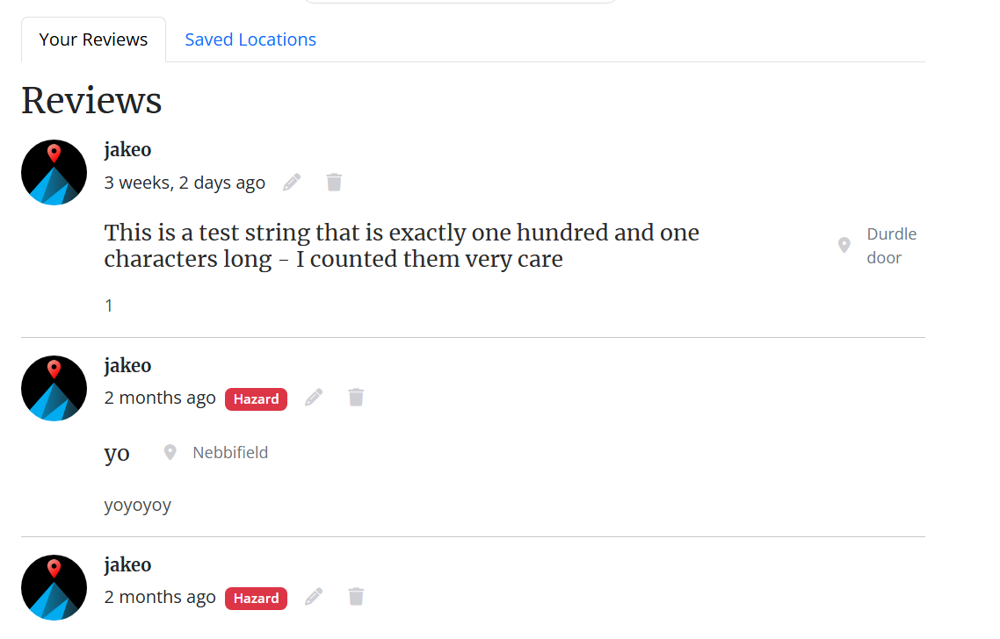

# Base Forum
The BASE Forum application serves as a dedicated platform for the BASE jumping community, offering detailed information about jumping locations worldwide alongside crucial safety considerations for jumpers of all experience levels. Through personalized accounts, jumpers can save favorite locations and contribute reviews.
The live link can be found here: [Live Site - Base Forum](https://base-forum-630b73fc7bab.herokuapp.com/)


## Role of a Front-End developers
Front end developers can utilize designs and APIs in order to create a user friendly and intuitive interface to bring a brand to life. This is a fundamental role in customer facing business' for the modern age because everything has moved online. Not having that online presence can sink a company, for this reason a front end developer is a key part to a successful company in the modern world.

## React
React framework was implemented in the build of the website. It is a framework built on top of the javascript language for a better developer experience when creating websites. React is used to create components that can be reusable, this can improve user experience by standardizing the components used to build the website making it more intuitive for the end user and improves the branding of the website.
For example the reviews component was reused on multiple pages so they can be easily recognized by the user.

Reused React components are listed here.

## Table of Contents

* [User Experience Design](#user-experience-design)
  * [Strategy Plane](#strategy-plane)
    * [Site Goals](#site-goals)
    * [Agile Planning](#agile-planning)
      * [Epics](#epics)
      * [User Stories](#user-stories)
  * [Scope Plane](#scope-plane)
  * [Skeleton Plane](#skeleton-plane)
    * [Wireframes](#wireframes)
    * [Database Design](#database-design)
    * [Security](#security)
  * [Structure Plane](#structure-plane)
    * [Features](#features)
    * [Features Left To Implement](#features-left-to-implement)
  * [Surface Plane](#surface-plane)
    * [Design](#design)
    * [Colour Scheme](#colour-scheme)
    * [Typography](#typography)
    * [Imagery](#imagery)
  * [Technologies](#technologies)
  * [Testing](#testing)
  * [Deployment](#deployment)
    * [Version Control](#version-control)
    * [Heroku Deployment](#heroku-deployment)
    * [Run Locally](#run-locally)
    * [Fork Project](#fork-project)
  * [Credits](#credits)

# User-Experience-Design

## The-Strategy-Plane
### Site-Goals
Promote Safety
Create a reliable resource that prioritizes user safety through accurate location information, current conditions, and essential protocols.

Build Community
Foster an engaged BASE jumping community where members can share experiences, provide updates, and support fellow jumpers.

Ensure Accessibility
Maintain an easy-to-use platform that provides clear, organized information accessible to both novice and experienced jumpers.

Preserve Locations
Support the longevity of BASE jumping locations by promoting responsible use and environmental stewardship through education and awareness.

### Agile Planning

Agile planning for the "Base Forum" project was organized into one sprint for the API and three sprints for the frontend, each defined by milestones within GitHub. User stories and epics were added to the sprint as the project was in process. 

The sprint would be planned ahead of time, if all tasks were complete then another user story(task) would be added to the sprint.

#### Epics

Epics are large bodies of work that can be broken down into smaller tasks or user stories. For this project, the following epics were created:

- Authentication
- Locations
- Reviews
- Profile

#### User Stories

User stories are smaller, manageable tasks derived from the epics. They define specific requirements from the perspective of the end user. Below are examples of user stories for each epic:

- Create navigation bar ( not part of an epic )

**Authentication**
- Create account page
- Create Sign In page
- Create sign out page

**Locations**
- View locations
- Filter locations
- Search locations
- View location details

**Review**
- Create Review
- Update review
- Delete review

**Profile**
- Update Profile form
- View user reviews
- View user saved locations

## The-Scope-Plane

#### 1. User Profile Management
- Update user profiles
- Profile image upload
- View history of saved locations and reviews

#### 2. Location Management
- Browse locations with filtering options
- Detailed location pages with essential information
- Interactive map

#### 3. User Interactions
- Save/bookmark favorite locations
- Create, edit, and delete location reviews

#### 4. Responsive Design
- Mobile-first approach
- Support for devices 320px and up
- Hamburger menu for mobile navigation
- Optimized images and layout for different screen sizes

#### 5. Security Features
- User authentication
- Protected routes for registered users
- Form validation
- Secure data storage

## The-Skeleton-Plane
### Wireframes
<details>
<summary>Locations</summary>


</details>

<details>
<summary>Location details</summary>


</details>

<details>
<summary>Reviews</summary>


</details>

<details>
<summary>Add Review Form</summary>


</details>

<details>
<summary>Profile</summary>


</details>

<details>
<summary>Update Profile Form</summary>


</details>

<details>
<summary>Sign In</summary>


</details>

<details>
<summary>Sign Up</summary>


</details>

<details>
<summary>Sign Out</summary>


</details>

### Database diagram

<details>
<summary>Database diagram</summary>


</details>

### API Table

<details>
<summary>API Table</summary>

# API Endpoints

| Endpoint | HTTP Method | Action | Authentication Required | Permission |
|----------|-------------|---------|------------------------|------------|
| `/` | GET | Root route with API welcome message | No | None |
| `/admin/` | GET | Django admin interface | Yes | Admin only |
| `/api-auth/` | GET | DRF authentication views | No | None |
| `/dj-rest-auth/logout/` | POST | Logout user and clear JWT cookies | Yes | Authenticated users |
| `/dj-rest-auth/` | Various | Authentication endpoints (login, user details, etc.) | Varies | Varies |
| `/dj-rest-auth/registration/` | POST | User registration | No | None |
| `/locations/` | GET | List all locations | No | Anyone |
| `/locations/` | POST | Create a new location | Yes | Superuser only |
| `/locations/<int:pk>/` | GET | Retrieve a specific location | No | Anyone |
| `/locations/<int:pk>/` | PUT/PATCH | Update a location | Yes | Superuser only |
| `/locations/<int:pk>/` | DELETE | Delete a location | Yes | Superuser only |
| `/profiles/` | GET | List all profiles | No | Anyone |
| `/profile/<int:pk>/` | GET | Retrieve a specific profile | No | Anyone |
| `/profile/<int:pk>/` | PUT/PATCH | Update a profile | Yes | Profile owner only |
| `/reviews/` | GET | List all reviews | No | Anyone |
| `/reviews/` | POST | Create a review | Yes | Authenticated users |
| `/reviews/<int:pk>/` | GET | Retrieve a specific review | No | Anyone |
| `/reviews/<int:pk>/` | PUT/PATCH | Update a review | Yes | Review owner only |
| `/reviews/<int:pk>/` | DELETE | Delete a review | Yes | Review owner only |
| `/saved-locations/` | GET | List user's saved locations | Yes | Authenticated user (own saves) |
| `/saved-locations/` | POST | Save a location | Yes | Authenticated users |
| `/saved-locations/<int:pk>/` | GET | Retrieve a specific saved location | Yes | Save owner only |
| `/saved-locations/<int:pk>/` | DELETE | Remove a saved location | Yes | Save owner only |

## Features

- Locations support filtering by country and searching by name/country
- Reviews can be filtered by location name and owner username
- Profiles can be searched by username
- Appropriate CORS headers are set up for frontend communication
- JWT authentication is used in production, while session authentication is used in development
- All list endpoints are paginated with 10 items per page
</details>

### Security

#### API Security
**Authentication & Authorization**

JWT
* Production environment uses JWT-based authentication with these security features:
  * `JWT_AUTH_SECURE=True` enabled
  * SameSite cookie policy
  * HTTP-only cookies for both authentication and refresh tokens

Permission Classes
* `IsOwnerOrReadOnly` - Restricts object modification to owners
* `IsSuperUserOrReadOnly` - Limits modifications to superusers
* Read-only access as default for unauthenticated users
* Protected routes requiring authentication (especially for saved locations)

**Data Security**

CORS Protection
* Specific allowed origins configured
* Credentials only accepted from trusted origins
* Separate CORS settings for development/production environments

Input Validation
* Location serializer includes comprehensive validation:
  * Coordinate boundary checking
  * Height and measurement validations
  * Date validity checks
* Field-level validations:
  * Length restrictions
  * Data type verification
* Duplicate entry prevention for saved locations
* Content length restrictions

Database Security
* Secret key management through environment variables

Additional Security
* Standard Django security features enabled:
  * CSRF protection
  * Security middleware
  * Password validation rules
* Cloudinary secure URL handling for media storage
* Environment-based debug mode configuration

#### UI Security

Protected Routes
- `ProtectedRoute` component guards sensitive routes
- Redirects unauthenticated users to sign-in page
- Preserves attempted URL for post-login redirect

JWT Token Management
- Implements refresh token logic with expiration tracking 
- Uses local storage to manage refresh token timestamps
- Functions to check if tokens need refreshing
- Token cleanup on sign-out

Form Security
- Input validation and error handling in SignIn/SignUp forms
- Loading states to prevent multiple submissions
- Server-side error messages displayed to users

User Session Management
- Context-based user state management (`CurrentUserContext`)
- Proper sign-out functionality with state cleanup
- Profile-specific operations restricted to profile owners

UI Security Features
- Conditional rendering of sensitive UI elements based on user state
- Action confirmations for destructive operations (ConfirmationModal)
- Loading states to prevent accidental double-submissions

## The-Structure-Plane
### Reused components
<details>
<summary>Confirmation Modal</summary>

**Places used**
- Deletion of review
- Sign out

**User Story**: As a User, I want to sign out so that I can control which devices I stay logged in on
  
</details>

<details>
<summary>Review List</summary>

**Places used**
- Review page
- User reviews tab on profile page
- Under the location details card on the location details page


</details>

<details>
<summary>Review Form</summary>

**Places used**
- Available anywhere in the site when logged on
- Used to create and edit a review with small differences

**User Story**: As a User, I want to create a review so that I can offer my review to certain locations I have visited
  
</details>

### Site Features

#### Navigation
<details>
<summary>Navigation Features</summary>

- **User Story**: As a User, I want to view a navigation bar on every page so that I can easily navigate the website
  - Logged Out State:
    
  - Logged In State:
    
</details>

#### Authentication

<details>
<summary>Sign Up</summary>

- **User Story**: As a Guest User, I want to fill in the create account form so that I can have an account on the website
  
</details>

<details>
<summary>Sign In</summary>

- **User Story**: As a User, I want to log on to the website so that I can access my profile and make reviews
  
</details>

<details>
<summary>Sign Out</summary>

- **User Story**: As a User, I want to sign out so that I can control which devices I stay logged in on
  
</details>

#### Locations

<details>
<summary>Locations Page</summary>

- **User Stories**:
  - As a User, I want to search locations by name so that I can quickly navigate to a specific location
  - As a User, I want to navigate to locations page so that I can see the locations
  
</details>

<details>
<summary>Location Card</summary>


</details>

<details>
<summary>Location Groups</summary>

- Expanded View:
  
- Collapsed View:
  
</details>

<details>
<summary>Location Details Page</summary>

- **User Story**: As a User, I want to see location details so that I can see more in-depth information on the location I am interested in
  
</details>

#### Reviews

<details>
<summary>Reviews Page</summary>


</details>

<details>
<summary>Review Component</summary>

- **User Stories**:
  - As a User, I want to delete a review I created so that I can remove my review from a location
  - As a User, I want to edit old reviews so that I can update details of the review

- Review States:
  - Standard Review:
    
  - Non-User Review:
    
  - Location Details Review:
    
</details>

<details>
<summary>Review Form</summary>

- **User Story**: As a User, I want to create a review so that I can offer my review to certain locations I have visited
  
</details>

#### Profile

<details>
<summary>Profile Page</summary>


</details>

<details>
<summary>Profile Card</summary>


</details>

<details>
<summary>Saved Locations Tab</summary>

- **User Story**: As a Logged in User, I want to visit my profile so that I can easily view and manage my saved locations
  
</details>

<details>
<summary>User Reviews Tab</summary>

- **User Story**: As a logged on User, I want to see my reviews so that I can easily manage my reviews
  
</details>

<details>
<summary>Update Profile Form</summary>

- **User Story**: As a logged in User, I want to update/edit my account so that I can personalize my experience
  
</details>

### Features Left To Implement
In future releases the following features will be implemented...
- Email required on sign up
- Make the app more social allowing users to follow and view others profiles
- Include a weather API for live weather updates at the locations
- Scroll arrows on location details page to go to the next/previous location

## The-Surface-Plane
### Colour-Scheme
The two colors below complement nicely and add a nice outdoorsy yet professional feel to the site. They are the two predominantly used colors throughout.

<details>
<summary>Color 1</summary>

#2444b1


</details>

<details>
<summary>Color 2</summary>

#24242c 


</details>

### Typography

**Font Families**
- **Main Application:** "Open Sans", sans-serif
- **Headings (h1-h6):** "Merriweather", serif  
- **Logo title:** "Rubik Mono One", sans-serif

**Font Sizes**
- Title: 0.9rem
- Mobile (<768px): 0.8rem

**Text Styling**

Links
 - Color: #555555 (gray)

Icons
 - Default: #cfced3 (light gray) 
 - Hover: #2142b2 (blue)

Logo title
 - Color: #cfced3 (light gray)

### Imagery
The logo was created by [@Buzzzy](https://www.fiverr.com/buzzzy?source=order_page_user_message_link) on fiverr, I own the rights to this logo.

The BASE jumping images for the locations are pulled from my friend [@mountainmanbase's](https://www.instagram.com/mountainmanbase/) instagram, with his permission of course.

## Technologies

### UI Technologies

**Core:**
- React 18.3.1
- React Router DOM 6.28.0
- React Bootstrap 2.10.5

**API & Data Handling:**
- Axios 1.7.7
- JWT Decode 4.0.0

**UI Components & Styling:**
- Bootstrap 5.3.3
- MDB React UI Kit 9.0.0
- React Select 5.8.3
- React Hot Toast 2.4.1

**Map Functionality:**
- Leaflet 1.9.4
- React Leaflet 4.2.1

**Testing:**
- Vitest 2.1.8
- Jest Environment JSDOM 29.7.0
- Testing Library React 16.1.0
- MSW (Mock Service Worker) 2.6.8

**Development Tools:**
- React Scripts 5.0.1
- Babel Preset ENV & React 7.26
- ESLint with React config

### API Technologies

**Django & Django REST Framework**
Django==3.2.4
djangorestframework==3.12.4
django-filter==2.4.0
django-cors-headers

**Authentication**
dj-rest-auth==2.1.9
django-allauth==0.53.0
djangorestframework-simplejwt==4.7.2
PyJWT==2.1.0
oauthlib==3.1.1
python3-openid==3.2.0

**Database**
dj-database-url==0.5.0
psycopg2==2.9.10
sqlparse==0.4.1

**Media Storage**
cloudinary==1.25.0
django-cloudinary-storage==0.3.0
pillow

**Security & Encryption**
cryptography==3.4.8
defusedxml==0.7.1

**HTTP & Requests**
certifi==2024.8.30
charset-normalizer==3.4.0
idna==3.10
requests==2.32.3
requests-oauthlib==1.3.0
urllib3==1.26.15

**Server**
gunicorn==23.0.0

**Python Utilities**
asgiref==3.8.1
cffi==1.17.1
packaging==24.1
pycparser==2.22
pytz==2021.1
setuptools==69.5.1
six==1.16.0

## Testing 

Due to the size of the README tests have been moved into a separate markdown file. Please click the link below to view the tests.

[Testing File](./TESTING.md)

## Deployment

### Version Control

The site was created using the Visual Studio Code editor and pushed to github to remote repositories ‘base-forum’ for the UI and 'base-locations-api' for the API.

The following git commands were used throughout development to push code to the remote repo:

```git add <file>``` - This command was used to add the file(s) to the staging area before they are committed.

```git commit -m “commit message”``` - This command was used to commit changes to the local repository queue ready for the final step.

```git push``` - This command was used to push all committed code to the remote repository on github.

### Heroku Deployment

The site was deployed to Heroku. The steps to deploy are as follows:

**UI**
To deploy the UI do the same process for the API minus the config vars steps.

**API**
- Navigate to heroku and create an account
- Click the new button in the top right corner
- Select create new app
- Enter app name
- Select region and click create app
- Go to the settings tab and then click reveal config vars
- Add the following config vars to the API app:
  - ALLOWED_HOST: (Your allowed host)
  - CLIENT_ORIGIN: (Your client origin url)
  - SECRET_KEY: (Your secret key)
  - DATABASE_URL: (This should already exist with add on of postgres)
  - CLOUNDINARY_URL: (cloudinary api url)
  - DISABLE_COLLECTSTATIC: 1 

- Click the deploy tab
- Scroll down to Connect to GitHub and sign in / authorize when prompted
- In the search box, find the repository you want to deploy and click connect
- Scroll down to Manual deploy and choose the main branch
- Click deploy

The app should now be deployed.

The live link can be found here: [Live UI](https://base-forum-630b73fc7bab.herokuapp.com/) [Live API](https://base-locations-api-29bf40c34f1d.herokuapp.com/)

### Run Locally

Navigate to the GitHub Repository you want to clone to use locally:

- Click on the code drop down button
- Click on HTTPS
- Copy the repository link to the clipboard
- Open your IDE of choice (git must be installed for the next steps)
- Type git clone copied-git-url into the IDE terminal

The project will now have been cloned on your local machine for use.

### Fork Project

Most commonly, forks are used to either propose changes to someone else's project or to use someone else's project as a starting point for your own idea.

- Navigate to the GitHub Repository you want to fork.

- On the top right of the page under the header, click the fork button.

- This will create a duplicate of the full project in your GitHub Repository.

## Credits

**File Structure:** [Profy.dev - React Folder Structure](https://profy.dev/article/react-folder-structure)

**Review component Design:** [MDB React - Comments Component](https://mdbootstrap.com/docs/react/extended/comments/)

**Map Implementation:** 
 - [React Leaflet Documentation](https://react-leaflet.js.org/docs/start-setup/)
 - [React Leaflet Issue #453](https://github.com/PaulLeCam/react-leaflet/issues/453)