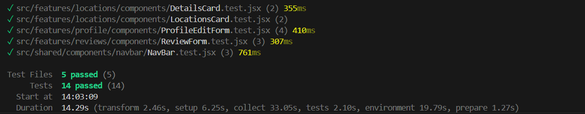

# Base Forum Tests

## Table of Contents

* [Functional Tests](#functional-tests)
* [Unit Tests](#unit-tests)
* [Accessibility](#accessibility)
* [Validator Testing](#validator-testing)
  * [HTML](#html)
  * [PEP8](#pep8)
  * [JSHint](#JSHint)
  * [ESLint](#Eslint)
* [Lighthouse Report](#lighthouse-report)
* [Responsiveness](#responsiveness)

## Functional tests

| Test Steps | Expected | Actual | Status | Reflected in API |
|------------|----------|---------|---------|----------------|
| **Sign Up Tests** |
| Input username more than 50 characters | Error message should display | Error message displayed | ✅ PASS | -- |
| Input username already taken | Error message should display | Error message displayed | ✅ PASS | ✅ PASS |
| Input password less than 8 characters | Error message should display | Error message displayed | ✅ PASS | -- |
| Input passwords don't match | Error message should display | Error message displayed | ✅ PASS | -- |
| Input with correct values | User should be registered and redirected | User registered and redirected | ✅ PASS | ✅ PASS |
| **Sign In Tests** |
| Input username more than 50 characters | Error message should display | Error message displayed | ✅ PASS | -- |
| Input password incorrect | Error message should display | Error message displayed | ✅ PASS | -- |
| Input with username that does not exist | Error message should display | Error message displayed | ✅ PASS | ✅ PASS |
| Input with correct credentials | User should be logged in and redirected | User logged in and redirected | ✅ PASS | -- |
| **Review Form Tests** |
| Input subject over 100 characters | Error message should display | Error message displayed | ✅ PASS | -- |
| Input content over 500 characters | Error message should display | Error message displayed | ✅ PASS | -- |
| Try location that does not exist | Error message should display | Error message displayed | ✅ PASS | ✅ PASS |
| Try to double click submit to submit twice | Only one submission should be processed | One submission processed | ✅ PASS | ✅ PASS |
| Review form click close | Form should close without submitting | Form closed without submission | ✅ PASS | -- |
| Review form with correct values | Review should be submitted successfully | Review submitted successfully | ✅ PASS | ✅ PASS |
| **Profile Edit Tests** |
| Profile edit form only allows images for profile photo upload | Non-image files should not be available | Non-image files unavailable | ✅ PASS | -- |
| Input name more than 50 characters | Should restrict typing | restricts typing | ✅ PASS | -- |
| Try negative Base jump numbers | Error message should display | Error message displayed | ✅ PASS | ✅ PASS |
| Click cancel | Form should close without saving changes | Form closed without saving | ✅ PASS | -- |
| Submit correct values | Profile should update successfully | Profile updated successfully | ✅ PASS | ✅ PASS |
| **Profile View Tests** |
| View Profile page user reviews tab | Should display user's reviews | User reviews displayed | ✅ PASS | ✅ PASS |
| View Profile page user details | Should display user information | User information displayed | ✅ PASS | ✅ PASS |
| View Profile page saved locations tab | Should display saved locations | Saved locations displayed | ✅ PASS | ✅ PASS |
| **Location Tests** |
| View locations page | Should display country groups and search input | Country groups and search input displayed | ✅ PASS | ✅ PASS |
| Search for country that exists | Should display matching countries | Matching countries displayed | ✅ PASS | ✅ PASS |
| Search for location that exists | Should display matching locations | Matching locations displayed | ✅ PASS | ✅ PASS |
| Search random word that does not exist | Should display no results message | No results message displayed | ✅ PASS | ✅ PASS |
| Click country group on locations page | Should expand/collapse country group with relevant locations | Country group expanded/collapsed with relevant locations | ✅ PASS | -- |
| Click more info on location card | Should navigate to location details | Navigated to location details | ✅ PASS | -- |
| **Location Details Tests** |
| View location details page | Should display location information | Location information displayed | ✅ PASS | ✅ PASS |
| View location details as logged in user | Should show Save and add review buttons | All features displayed | ✅ PASS | -- |
| View location details as non logged in user | Should hide save and add review buttons | Limited features displayed | ✅ PASS | -- |
| View location details with reviews | Should display location reviews | Reviews displayed | ✅ PASS | ✅ PASS |
| Click copy to clipboard icon | Should copy location coordinates to clipboard | Coordinates copied to clipboard | ✅ PASS | -- |
| Click save button (logged in) | Should save location to user profile | Location saved to profile | ✅ PASS | ✅ PASS |
| Click add review button (logged in) | Should open review form | Review form opened | ✅ PASS | -- |
| **Reviews Tests** |
| View Reviews page | Should display all reviews, newest first | All reviews displayed, newest first | ✅ PASS | ✅ PASS |
| View user review | Should display user's review with edit/ delete options | User review displayed with edit/ delete options | ✅ PASS | -- |
| View other users review | Should display other users' reviews without edit/ delete options | Other users' reviews displayed without edit/ delete options | ✅ PASS | ✅ PASS |
| Click edit icon on user review | Should open prepopulated review form modal with update review button | Opened prepopulated review form modal with update review button | ✅ PASS | -- |
| Click delete icon on user review | Should show delete confirmation | Delete confirmation shown | ✅ PASS | -- |
| Cancel delete review modal | Should cancel delete, review still exists | Delete review cancelled, review still exists | ✅ PASS | -- |
| Confirm delete review modal | Should delete review | Deleted review | ✅ PASS | ✅ PASS |
| **Navigation Tests (Logged Out)** |
| View navigation bar as logged out user | Should show guest navigation options | Guest options displayed | ✅ PASS | -- |
| Click logo in navigation bar | Should navigate to home page | Navigated to home page | ✅ PASS | -- |
| Click locations link in navigation bar | Should navigate to locations page | Navigated to locations page | ✅ PASS | -- |
| Click Reviews link in navigation bar | Should Navigate to reviews page | Navigated to reviews page | ✅ PASS | -- |
| Click 'sign in' link in navigation bar | Should navigate to sign in page | Navigated to sign in page | ✅ PASS | -- |
| Click sign up link in navigation bar | Should navigate to sign up page | Navigated to sign up page | ✅ PASS | -- |
| **Navigation Tests (Logged In)** |
| View navigation bar as logged in user | Should show user navigation options | User options displayed | ✅ PASS | -- |
| Click add review link in navigation bar | Should Open add review modal with form | Navigated to add reviews modal | ✅ PASS | -- |
| Click profile link in navigation bar | Should navigate to profile page | Navigated to profile page | ✅ PASS | -- |
| Click sign out link in navigation bar | Should show sign out confirmation | Sign out confirmation shown | ✅ PASS | -- |
| Click cancel in sign out confirmation modal | Should close modal without signing out | Modal closed, user still logged in | ✅ PASS | -- |
| Confirm Signout in confirmation modal | Should sign out user and redirect | User signed out and redirected | ✅ PASS | -- |
| **Contact Form Tests** |
| Contact form with correct details | Success message should display | Success message should display | ✅ PASS | ✅ PASS |
| Contact form with no name | Error message should display | Error message displayed | ✅ PASS | -- |
| Contact form with no email | Error message should display | Error message displayed | ✅ PASS | -- |
| Contact form with no message | Error message should display | Error message displayed | ✅ PASS | -- |
| Contact form with message under 10 characters | Error message should display | Error message displayed | ✅ PASS | -- |
| Contact form with incorrect email format | Error message should display | Error message displayed | ✅ PASS | -- |
| **Footer Navigation Tests** |
| Footer Locations nav link | Should navigate to locations page | Navigated to locations page | ✅ PASS | -- |
| Footer Reviews nav link | Should navigate to reviews page | Navigated to reviews page | ✅ PASS | -- |
| Footer Home nav link | Should navigate to home page | Navigated to home page | ✅ PASS | -- |
| **Location Management Tests** |
| Locations card edit button appears for Admin | Should display edit button | Edit button displayed | ✅ PASS | ✅ PASS |
| Locations card edit button does not appear for non-admin | Should not display edit button | Edit button not displayed | ✅ PASS | ✅ PASS |
| Locations card delete button appears for Admin | Should display delete button | Delete button displayed | ✅ PASS | ✅ PASS |
| Locations card delete button does not appear for non-admin | Should not display delete button | Delete button not displayed | ✅ PASS | ✅ PASS |
| Add location button appears for Admin | Should display add button | Add button displayed | ✅ PASS | ✅ PASS |
| Add location button does not appear for non-admin | Should not display add button | Add button not displayed | ✅ PASS | ✅ PASS |
| Edit location form loads when edit location button clicked | Should open edit form | Edit form opened | ✅ PASS | -- |
| Delete location modal, deletes location | Should delete location | Location deleted | ✅ PASS | ✅ PASS |
| Add location form loads when add location button clicked | Should open add form | Add form opened | ✅ PASS | -- |
| Location form with no name | Error message should display | Error message displayed | ✅ PASS | -- |
| Location form with no Country | Error message should display | Error message displayed | ✅ PASS | -- |
| Location form with no latitude | Error message should display | Error message displayed | ✅ PASS | -- |
| Location form with no longitude | Error message should display | Error message displayed | ✅ PASS | -- |
| Location form with incorrect image url | Error message should display | Error message displayed | ✅ PASS | -- |
| Location form with negative total height | Error message should display | Error message displayed | ✅ PASS | -- |
| Location form with negative rock drop | Error message should display | Error message displayed | ✅ PASS | -- |
| Location form with correct details | Should submit successfully | Form submitted successfully | ✅ PASS | ✅ PASS |

## Unit tests



The project implements comprehensive unit testing using Vitest and Mock Service Worker (MSW) for API mocking. Tests focus on component functionality, user interactions, and integration with the application's context providers.

### Testing technologies

- **Vitest**: Main test runner and assertion library
- **Mock Service Worker (MSW)**: API mocking for consistent test environments

### Test Setup

The project uses a custom test setup configuration in `setupTests.js`:
- Configures Jest DOM matchers
- Sets up MSW server for API mocking
- Mocks `window.matchMedia` for Bootstrap component compatibility

### Key Test Files

**Component Tests:**
- `DetailsCard.test.jsx`: Tests location details display
- `LocationCard.test.jsx`: Validates location card rendering and navigation
- `NavBar.test.jsx`: Tests navigation and authentication states
- `ProfileEditForm.test.jsx`: Validates profile editing functionality
- `ReviewForm.test.jsx`: Tests review creation and validation

### Mock Implementations

MSW handlers provide consistent API responses for:
- User authentication
- Profile data
- Location data
- Review operations

### Running Tests

Tests can be run using the following npm script:
```bash
npm run test
```

The test script uses Vitest configurations defined in `vite.config.js`:
```javascript
test: {
  globals: true,
  environment: 'jsdom',
  setupFiles: './src/test/setup/setupTests.js',
}
```

## Accessibility 
[Wave Accessibility](https://wave.webaim.org/) tool was used throughout development and for final testing of the deployed website to check for any aid accessibility testing.

Wave picked up on the following problems that were resolved:
- Links having no text for screen-readers
- Nav links not having enough contrast
- Missing form label on location search

Testing was focused to ensure the following criteria were met:

- All forms have associated labels or aria-labels so that this is read out on a screen reader to users who tab to form inputs
- Color contrasts meet a minimum ratio as specified in [WCAG 2.1 Contrast Guidelines](https://www.w3.org/WAI/WCAG21/Understanding/contrast-minimum.html)
- Heading levels are not missed or skipped to ensure the importance of content is relayed correctly to the end user
- All content is contained within landmarks to ensure ease of use for assistive technology, allowing the user to navigate by page regions
- All non-textual content had alternative text or titles so descriptions are read out to screen readers
- HTML page lang attribute has been set
- Aria properties have been implemented correctly
- WCAG 2.1 Coding best practices being followed

## Validator testing

### HTML Validator

All pages were run through the [w3 HTML Validator](https://validator.w3.org/nu/). All of these issues were corrected and all pages passed validation.

### Pep8
All pages were run through the official [Pep 8](https://pep8ci.herokuapp.com/#)
 validator to ensure all code was pep8 compliant. Some errors were shown due to blank spacing and lines too long, 1 line instead of 2 expected. All of these errors were resolved and code passed through the validator.

### JSHint
JSHint was used to check/correct .js (javascript) files. This helped fix minor issues to ensure best practices in how the code is written.

### Eslint
ESLint played a crucial role in maintaining code quality and consistency throughout the project. The configuration was set up to enforce best practices for React development, accessibility, and general JavaScript coding standards.

#### Key ESLint Features
- **Environment Configuration**:
  - Browser and ES2021 features enabled
  - Jest testing environment support
  - Node.js compatibility

- **Extended Configurations**:
  - `eslint:recommended` for core JavaScript rules
  - `plugin:react/recommended` for React-specific best practices
  - `plugin:react-hooks/recommended` for React Hooks rules
  - `plugin:jsx-a11y/recommended` for accessibility standards
  - `plugin:import/errors` and `plugin:import/warnings` for import/export validation

#### Custom Rule Sets

**React Rules**:
- Disabled prop-types validation (using TypeScript instead)
- Enforced proper JSX variable usage
- Configured file extension rules for .jsx files
- Added warnings for prop spreading

**React Hooks Rules**:
- Strict enforcement of hooks usage rules
- Dependencies array validation

**Import Rules**:
- Organized imports with enforced grouping and alphabetical ordering
- Validated all imports resolve correctly
- Required proper named import usage

**General JavaScript Rules**:
- Configured unused variable handling with exceptions for underscore prefixes
- Limited console usage to warning and error only
- Enforced const usage where possible
- Prohibited var usage

**Code Style Rules**:
- Single quotes for strings
- Required semicolons
- Consistent comma-dangling in multiline

#### NPM Scripts
The project includes dedicated npm scripts for linting:
```json
"scripts": {
  "lint": "eslint src --ext .js,.jsx",
  "lint:fix": "eslint src --ext .js,.jsx --fix",
  "lint:watch": "esw -w src --ext .js,.jsx"
}
```

These scripts allow developers to:
- Check for linting errors
- Automatically fix linting issues where possible
- Watch for changes and lint in real-time during development

## Lighthouse report

The lighthouse report came back pretty positive. The only concern I had was with the orange result for best practices caused by the third party cookies used with the DRF API. The warning was to inform the site creator that google are moving away from third party cookies. So it is something i can consider fixing in the future.


## Responsiveness
All pages were tested to ensure responsiveness on screen sizes from 320px and upwards as defined in WCAG 2.1 Reflow criteria for responsive design on Chrome, Edge, Firefox and Opera browsers.

Steps to test:

- Open browser and navigate to [BASE Forum](https://base-forum-630b73fc7bab.herokuapp.com/)
- Open the developer tools (right click and inspect)
- Set to responsive and decrease width to 320px
- Set the zoom to 50%
- Click and drag the responsive window to maximum width

Expected:

Website is responsive on all screen sizes and no images are pixelated or stretched. No horizontal scroll is present. No elements overlap.

Actual:

Website behaved as expected.
